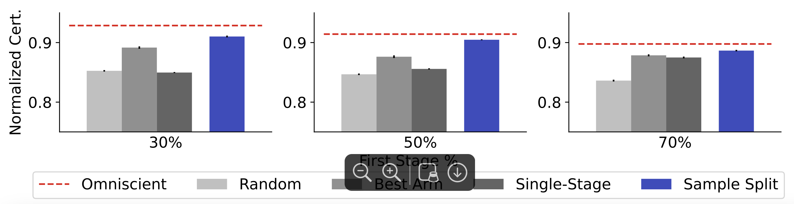

# Data-driven Design of Randomized Control Trials with Guaranteed Treatment Effects


This repository contains the implementation for the paper ["Data-driven Design of Randomized Control Trials with Guaranteed Treatment Effects"](https://arxiv.org/abs/2410.11212).

This work was done by [Santiago Cortes-Gomez](https://secg5.github.io), [Naveen Raman](https://naveenraman.com), [Aarti Singh](http://www.cs.cmu.edu/~aarti/), and [Bryan Wilder](https://bryanwilder.github.io). 

#### TL;DR 

Randomized controlled trials (RCTs) can be used to generate guarantees on treatment effects. 
However, RCTs often spend unnecessary resources exploring sub-optimal treatments, which can reduce the power of treatment guarantees. 
To address these concerns, we develop a two-stage RCT  where, first on a data-driven screening stage, we prune low-impact treatments, while in the second stage, we develop high probability lower bounds on the treatment effect. 

## Citation
If you use our code for your research, please cite this as
```
@article{cortes2024data,
  title={Data-driven Design of Randomized Control Trials with Guaranteed Treatment Effects},
  author={Cortes-Gomez, Santiago and Raman, Naveen and Singh, Aarti and Wilder, Bryan},
  journal={arXiv preprint arXiv:2410.11212},
  year={2024}
}
```
## Setup

#### Installation
To run experiments, first clone this repository

```$ git clone https://github.com/secg5/risk_certificate``` 

Then to install the dependencies run the following
```
$ conda env create --file environment.yaml
$ conda activate certificate
$ pip install -e .
$ bash scripts/bash_scripts/create_folders.sh
```

This will create a new environment, called `certificate`, from which to run the code
To test whether the installation was successful, run 
```import certificate```

#### Evaluating Policies
To evaluate policies, run the `scripts/notebooks/All Policies.ipynb` notebook. 
This notebook evaluates all policies based on a set of parameters, and writes results to the `results/${out_folder}` folder, where out_folder is a parameter. 

#### Re-Running Experiments
All bash scripts for experiments can be found in the `scripts/bash_scripts` folder. 
To run all the experiments, run `bash scripts/bash_scripts/run_all.sh`

#### Running custom policies
To run custom policies, define a function that takes in the arm means, number of arms, total budget (T), delta, seed, and the distribution of arms. 
For example, we present the successive elimination policy: 
```
def successive_elimination(arm_means, num_arms, total_steps, delta,seed,arm_distribution):
    """Successive Elimination algorithm for best arm identification.

    Parameters:
        arm_means (list or np.array): True means of the arms (for simulation).
        num_arms (int): Number of arms.
        total_steps (int): Total number of time steps for pulling arms.
        delta (float): Confidence parameter.

    Returns:
        best_arm (int): The index of the identified best arm.
        confidence_bound (list): Number of pulls for each arm.
    """
    np.random.seed(seed)
    arm_pulls = np.zeros(num_arms)
    empirical_means = np.zeros(num_arms)
    remaining_arms = list(range(num_arms))
    
    step = 0
    while len(remaining_arms) > 1 and step < total_steps:
        for arm in remaining_arms:
            arm_pulls[arm] += 1

            if arm_distribution == 'effect_size':
                reward =  np.random.normal(arm_means[arm],1)
            else:
                reward =  np.random.binomial(1, arm_means[arm])
            empirical_means[arm] = ((empirical_means[arm] * (arm_pulls[arm] - 1)) + reward) / arm_pulls[arm]
            step += 1
            if step >= total_steps:
                break
        
        # Update confidence bounds
        if arm_distribution == 'effect_size':
            confidence_bound = compute_subgaussian_bound_one_way(arm_pulls[remaining_arms],delta)
        else:
            confidence_bound = compute_hoeffding_bound_one_way(arm_pulls[remaining_arms],delta)
        
        # Calculate upper and lower bounds
        # Here we do need the 2/delta
        upper_bounds = empirical_means[remaining_arms] + confidence_bound
        lower_bounds = empirical_means[remaining_arms] - confidence_bound
        
        # Find the best arm based on current estimates
        best_arm_index = np.argmax(empirical_means[remaining_arms])
        
        # Eliminate arms whose upper bound is worse than the best arm's lower bound
        remaining_arms = [
            arm for i, arm in enumerate(remaining_arms)
            if upper_bounds[i] >= lower_bounds[best_arm_index]
        ]

    return lower_bounds, confidence_bound
```

## Results
Our results are available in a zip file [here](https://cmu.box.com/s/9l8rk948qn00tf8zt9kgb0st9vuu024o). 